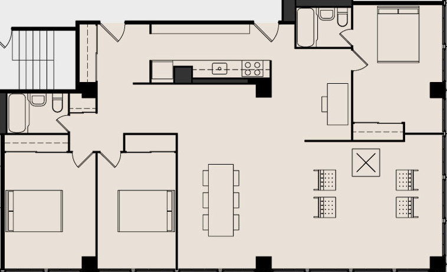
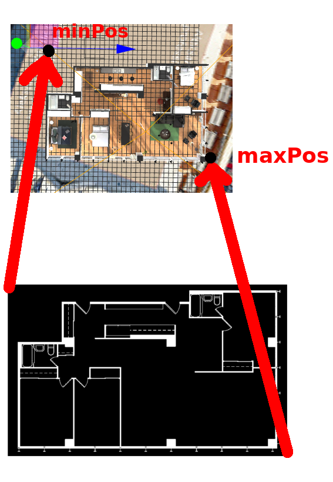

# 3dio-floorplan-guide
This is a tiny guide on how to make a minimap HTML element in aframe

1. Create an aframe webapp from your 3d.io scene on https://appcreator.3d.io/  
   If your scene was created with the [3d.io editor](https://spaces.archilogic.com/dashboard), make sure you find the ``a-entity`` with ``class="io3d-scene"`` and check it's ``rotation``. It should be``0 0 0``.
1. Add the HTML elements for the minimap
  ```html
   <!-- Floorplan -->
   <div id="floorplan-wrapper" class="overlay">
     <div id="floorplan-container">
       
       
     </div>
   </div>
  ```
1. Add some CSS to your website to style them. Later, the JS code will write a style attribute into the ``floorplan-camera-icon`` that sets the position of the icon relative to the ``floorplan-container`` in pixels
  ```css
    #floorplan-wrapper {
      user-select: none;
      position: fixed;
      top: 5%;
      right: 5%;
      padding: 0;
      z-index: 1000;
      width: 250px;
    }
    @media only screen and (max-width: 800px) {
      #floorplan-wrapper {
        width: 100px;
      }
    }
    #floorplan-container {
      position: relative;
      width: 100%;
      padding: 0;
      z-index: 1000;
    }
    img#floorplan {
      width: 100%;
      height: 100%;
    }
    #floorplan-camera-icon {
     width:50px;
     width:50px;
     position: absolute;
     transition-property: left, top;
     transition-duration: 0.5s, 0.5s;
    }
  ```
1. [Here](https://github.com/mope1/3dio-floorplan-guide/blob/master/floorplan.js) is some basic javascript that listens to movements of the aframe camera and converts them into css code for the floorplan camera icon. **Make sure this code is executed after the aframe scene is loaded.**
2. press ``CTRL+ALT+I`` to launch the aframe inspector
3. create a new entity by hitting the plus sign on the top left
4. find your new entity on the bottom left and select it
5. drag your entity around until it represents ``minPos``, which is the top left corner of your floorplan in the 3d world.  
   See picture below:  
   
6. enter the **x** and **z** coordinates of your entity into the minPos variable in the minimap script
7. repeat for maxPos
8. You're done!
